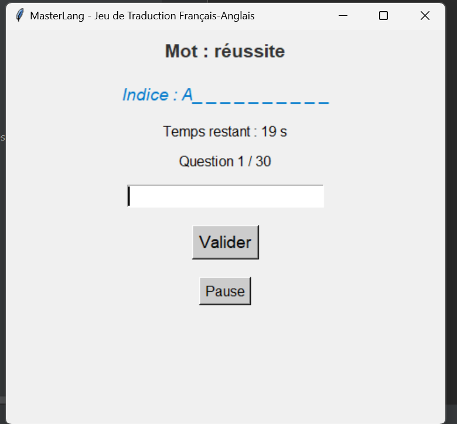
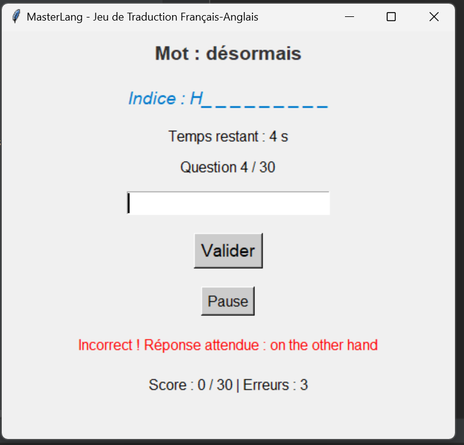
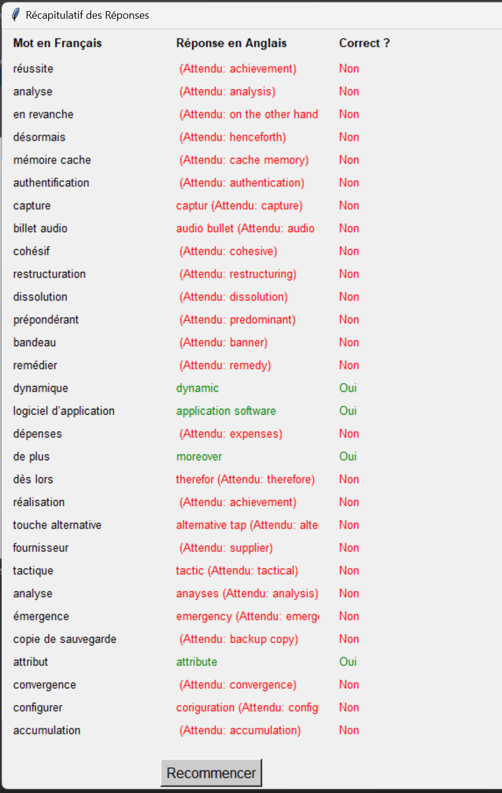

# MasterLang - Jeu de Traduction Français-Anglais

**MasterLang** est un jeu éducatif pour tester et améliorer vos compétences en traduction du français vers l'anglais. Il est conçu spécifiquement pour ceux qui souhaitent enrichir leur vocabulaire et s'entraîner de manière ludique, par exemple pour des examens comme le TOEIC.

## Fonctionnalités

- **Chronomètre par question** : Chaque question dispose de 20 secondes pour répondre.
- **30 questions par partie** : Testez votre vocabulaire avec 30 mots aléatoires tirés d'une base de données.
- **Bouton de pause** : Interrompez le chronomètre à tout moment.
- **Suivi des scores** : Suivez vos bonnes et mauvaises réponses en temps réel.
- **Récapitulatif final** : À la fin de la partie, visualisez un tableau récapitulatif des réponses avec des indications colorées (vert pour correct, rouge pour incorrect).
- **Option de recommencer** : Redémarrez facilement une nouvelle partie après la fin du jeu.

## Capture d'Écran

### Exemple de Jeu en Cours


### Réponse Incorrecte


### Récapitulatif des Questions


## Installation

### Prérequis

- **Python 3.11** ou une version plus récente.
- **MySQL** pour la base de données de vocabulaire.
- **Bibliothèques Python** :
  - `mysql-connector-python` : Pour la connexion à la base de données MySQL.
  - `tkinter` : Interface graphique (installée par défaut avec Python).
  - `winsound` : Pour les effets sonores (Windows uniquement).

### Étapes d'Installation

1. **Clonez le dépôt** :

   ```bash
   git clone https://github.com/votre-utilisateur/MasterLang.git
   cd MasterLang
1. **Intallez les dépendances** :
    ```bash
   pip install mysql-connector-python
   
### Étapes d'Installation

- **Démarrage** : Une fois le jeu lancé, un mot en français apparaît avec un indice en anglais. Vous disposez de 20 secondes pour taper la traduction anglaise.
- **Réponses et score** : Après chaque question, le jeu affiche si votre réponse est correcte ou incorrecte et met à jour le score.
- **Pause** : Utilisez le bouton "Pause" pour interrompre le chronomètre si vous avez besoin de plus de temps.
- **Récapitulatif final** : À la fin des 30 questions, un tableau récapitulatif s’affiche avec vos réponses. Les réponses correctes sont indiquées en vert et les incorrectes en rouge, avec la traduction correcte affichée.
- **Recommencer** : Cliquez sur le bouton "Recommencer" pour lancer une nouvelle partie.

### Contribuer
Les contributions sont les bienvenues ! Si vous souhaitez améliorer le projet, corriger des bugs ou ajouter de nouvelles fonctionnalités, n'hésitez pas à ouvrir une issue ou à soumettre une pull request.

- **Forkez le dépôt.**
- **Créez une branche pour votre fonctionnalité (git checkout -b nouvelle-fonctionnalité).**
- **Effectuez vos changements et faites un commit (git commit -m 'Ajouter nouvelle fonctionnalité').**
- **Poussez vers votre branche (git push origin nouvelle-fonctionnalité).**
- **Ouvrez une pull request.**


---

                                                                    **Créé par 𝒪𝓈𝒶𝓂𝒶**

